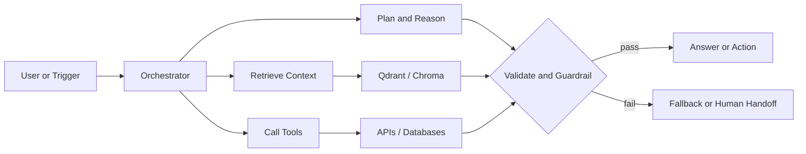

<div align="center">

# Roydon Sequeira

### GenAI Engineer · AI Agent Architect · LLM Systems Builder

I design and ship production AI systems that reason, retrieve, use tools, and know when to escalate.

[](https://roydonsequeira.com)
[](https://www.linkedin.com/in/roydonsequeira/)
[](https://github.com/roydonsequeira)
[](mailto:roydnsequeira@gmail.com)

</div>

## At A Glance

```text
Based in       Udupi, Karnataka, India
Specialty      Autonomous agents, LLM orchestration, RAG, healthcare AI
Core stack     Python, LangChain, Qdrant, FastAPI, Docker
Experience     2+ years building and deploying production AI systems
Availability   AI engineering roles, contracts, and focused AI projects
```

I am an AI Agent Developer at **Code Crew Studio** and also take on freelance and contract work. Previously, I was a GenAI Engineer at **ReinHealth.ai**, a stealth healthcare startup, where I helped deliver production medical AI agents and clinical automation.

## What I Build

| Capability | Practical focus |
| --- | --- |
| **Autonomous agents** | Multi-step reasoning, tool selection, memory, planning, and self-correction |
| **RAG systems** | Grounded retrieval over private documents, databases, and vector stores |
| **Healthcare AI** | Patient intake, clinical documentation, scheduling, and safety-aware automation |
| **AI backends** | FastAPI and Flask services, streaming responses, integrations, and observability |
| **Workflow automation** | n8n and LLM pipelines for operational processes and communication |

## Selected Work

### Areya · Production Medical AI Agent

An autonomous patient-intake agent supporting structured conversations over text and voice.

`LangChain` `Ollama` `Qdrant` `Flask` `PostgreSQL` `STT/TTS`

- Reduced intake time from approximately 15 minutes to under 5 minutes
- Reduced manual intake workload by an estimated 70%
- Kept patient data away from external APIs through local inference
- Combined RAG, tool use, safety checks, and emergency escalation logic

### CORTEX · Local-First Agent Framework

A private agent framework built for control, inspectability, and independence from hosted APIs.

`Python` `LATS` `Four-Tier Memory` `OpenTelemetry`

- Short-term, episodic, semantic, and procedural memory
- LATS-based tree-search planning with self-correction
- OpenTelemetry tracing across agent runs
- **Status:** Open-sourceable · **Domain:** Agent infrastructure

### AI Resume Analyzer

A three-agent evaluation pipeline for analyzing, improving, and formatting resumes.

`FastAPI` `BGE Embeddings` `Qdrant` `Gemini` `SSE`

- Deterministic scoring across keywords, semantics, experience, formatting, and impact
- Analyzer, Optimizer, and Formatter agents with streamed results
- Runs in under 400 ms excluding LLM calls
- 39 tests running in CI

### Clinical Automation Workflows

Production n8n workflows for clinical operations and documentation.

`n8n` `LLM Chains` `PostgreSQL` `STT/TTS`

- Appointment booking, rescheduling, and conflict detection
- Speech-to-text clinical documentation pipelines
- Strict validation designed to prevent fabricated medical data
- **Status:** Production · **Domain:** Healthcare automation

<details>
<summary><b>More projects</b></summary>

<br />

- **NEXUS** - AI content creation SaaS with multi-source crawling, LangChain, DALL-E 3, auto-publishing to LinkedIn and X, and Stripe billing
- **Personal AI Proxy Agent** - WhatsApp-based assistant for message routing, calendar management, and lead qualification using Twilio, FastAPI, LangChain, Claude API, and Qdrant
- **GitHub Code Review Agent** - Automated pull request review with tool-based reasoning
- **Skin Lesion Segmentation** - U-Net versus ResUNet on 2,596 ISIC 2018 dermoscopic images with a Streamlit visualization interface
- **AI Research Agent** - Multi-step research with web search, vector retrieval, and citation tracking

</details>

## Agent Design Principles



- Keep reasoning in the orchestrator and isolate retrieval and tool calls
- Ground answers in known data instead of relying on unsupported model memory
- Validate sensitive outputs before they become user-visible actions
- Trace failures so an agent can be debugged as a system, not guessed at as a prompt

## Stack

**Agents and LLMs**

LangChain · Claude API · OpenAI · Gemini · Ollama

**Retrieval and data**

Qdrant · ChromaDB · PostgreSQL · Redis

**Backend and infrastructure**

Python · FastAPI · Flask · Docker · Linux

**Automation and integrations**

n8n · Twilio · Stripe

**ML and computer vision**

TensorFlow · Keras · OpenCV · scikit-learn · Streamlit

**Developer tooling**

Git · GitHub Actions · VS Code · Cursor

<div align="center">

</div>

## Experience

| Role | Organization | Period |
| --- | --- | --- |
| **AI Agent Developer** | Code Crew Studio, Mumbai · Remote | Feb 2026 - Present |
| **Independent GenAI Engineer** | Freelance / Contract | Ongoing |
| **GenAI Engineer** | ReinHealth.ai · Stealth healthcare startup | Jul 2024 - Feb 2026 |
| **Machine Learning Intern** | Igeeks Technologies, Bangalore | Jun 2023 - Jul 2023 |

At ReinHealth.ai, I designed and shipped autonomous medical AI agents, RAG pipelines, and clinical workflow automation for production healthcare environments. At Igeeks Technologies, I built image-classification models with CNN, AlexNet, and MLP architectures using custom dataset pipelines.

## Education

- **B.E. in Artificial Intelligence & Machine Learning** - NMAM Institute of Technology, 2020-2024
- **Executive Post Graduate Certification in Data Science & AI** - iHUB DivyaSampark, IIT Roorkee, 2024-2026

## GitHub Activity

<div align="center">


<br />


</div>

## Let's Build Something Useful

I am open to **AI engineering roles, GenAI work, LLM systems, healthcare AI, contracts, and production automation projects**.

<div align="center">

[](https://roydonsequeira.com)
[](https://www.linkedin.com/in/roydonsequeira/)
[](mailto:roydnsequeira@gmail.com)

<br />


</div>
