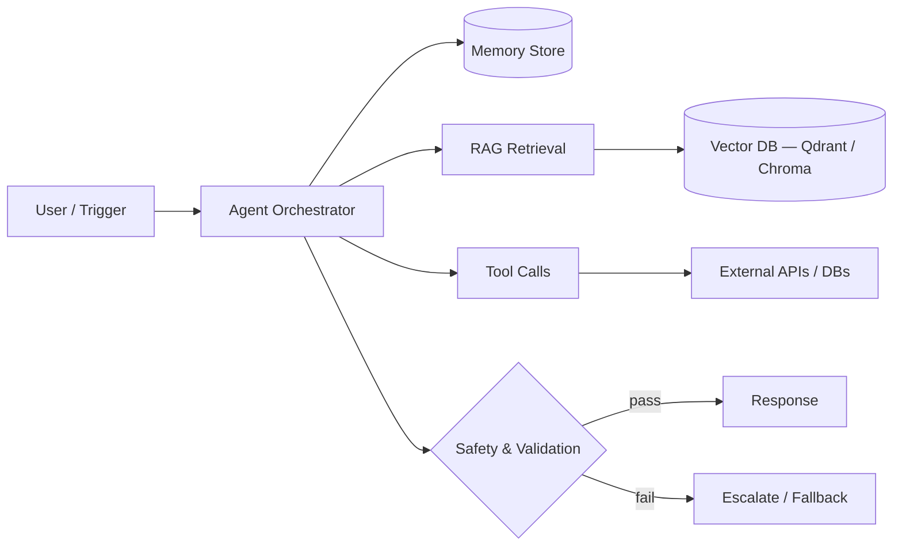

<div align="center">


<a href="https://github.com/roydonsequeira">
  
</a>

<br/>

[](https://www.linkedin.com/in/roydon-sequeira/)
[](https://github.com/roydonsequeira)
[](https://x.com/roydonsequeiraa)
[](https://mail.google.com/mail/?view=cm&fs=1&to=roydnsequeira@gmail.com)
[](https://roydonsequeira.com)

</div>

<br/>

```bash
$ whoami
GenAI engineer based in Udupi, India — ~2 years shipping production AI systems.

$ cat focus.txt
Autonomous agents, RAG pipelines, and LLM systems that hold up under real load —
not just in a demo. Deep in agent orchestration, memory architectures, and
healthcare-grade automation right now.

$ history | grep -i experience
ReinHealth.ai   →  medical AI agents, RAG pipelines, clinical automation  (2024–2026)
Freelance       →  agent systems, automation platforms, AI backend work  (ongoing)
```

---

## How I Build Agents



Reasoning stays in the orchestrator. Retrieval and tool calls are isolated so failures are traceable, not silent. Nothing reaches the user without a validation pass — this is the pattern behind most of what's below.

---

## Featured Builds

### CORTEX — Local AI Agent Framework
> A private, local-first agent framework built for control instead of API dependency.

`Python` `LATS Orchestration` `Four-Tier Memory` `OpenTelemetry`

- Four-tier memory: short-term, episodic, semantic, procedural
- LATS-based orchestration for tree-search style agent planning
- Full observability via OpenTelemetry tracing
- **Status:** Open-sourceable · **Domain:** Agent Infrastructure

---

### NEXUS — AI Content Creation SaaS
> End-to-end content pipeline: crawl, draft, generate, and publish — with billing built in.

`Python` `LangChain` `DALL-E 3` `Stripe`

- Multi-source crawling for content research
- Auto-publishing to LinkedIn and X
- DALL·E 3 generated cover images per post
- Stripe-metered subscription billing
- **Domain:** AI SaaS

---

### ADILA — WhatsApp Umrah Visa Automation
> A WhatsApp-native automation platform that handles Umrah visa workflows end to end.

`n8n` `WhatsApp API` `LLM Chains`

- Conversational intake and document collection over WhatsApp
- Automated visa processing workflow with status tracking
- **Domain:** Travel & Immigration Automation

---

### Clinical Automation Workflows (n8n)
> Production automation suite for clinical operations — appointments, notes, and documentation.

`n8n` `LLM Chains` `PostgreSQL` `STT/TTS`

- Intelligent appointment booking, rescheduling, and conflict detection
- Speech-to-text clinical documentation pipelines
- Strict validation to prevent fabricated medical data
- **Status:** Production · **Domain:** Healthcare Automation

<details>
<summary><b>More builds</b></summary>
<br/>

**AI Resume Analyzer** — FastAPI + BGE embeddings + Qdrant + Gemini, three-agent evaluation pipeline

**Personal AI Proxy Agent** — WhatsApp-based JARVIS-style assistant with message routing, calendar management, and lead qualification (Twilio, FastAPI, LangChain, Claude API, Qdrant)

**GitHub Code Review Agent** — Automated PR review system with tool-based reasoning

**Skin Lesion Segmentation** — U-Net vs ResUNet comparison on the ISIC 2018 dataset (2,596 dermoscopic images), Streamlit interface for clinical visualization

</details>

---

## Stack

<div align="center">

</div>

```yaml
agents:      [LangChain, Claude API, OpenAI, Gemini, Ollama]
retrieval:   [Qdrant, ChromaDB, PostgreSQL]
backend:     [FastAPI, Flask, Redis, Docker, Linux]
automation:  [n8n, Twilio, Stripe]
ml_cv:       [TensorFlow, Keras, OpenCV, scikit-learn, Streamlit]
tools:       [Git, GitHub Actions, VS Code, Cursor]
```

---

## Experience

**Independent GenAI Engineer** — Freelance / Contract · `2026 – Present`
Agent systems, automation platforms, and AI backend work for early-stage teams and healthcare clients.

**GenAI Engineer** — ReinHealth.ai (Stealth Healthcare Startup) · `Jul 2024 – Feb 2026`
Designed and shipped autonomous medical AI agents, RAG pipelines, and clinical workflow automation for production healthcare environments.

**Machine Learning Intern** — Igeeks Technologies, Bangalore · `Jun 2023 – Jul 2023`
Built image classification models using CNNs, AlexNet, and MLP architectures on custom dataset pipelines.

## Education

**B.E., Artificial Intelligence & Machine Learning** — NMAM Institute of Technology · `2020 – 2024`
**Executive PG, Data Science & AI** — IIT Roorkee (via Intellipaat) · `Ongoing`

---

<div align="center">


<!-- Needs .github/workflows/snake.yml enabled once — see the file from earlier in this chat -->


</div>

---

<div align="center">

**Open to work on AI Engineering, GenAI, LLM systems, and healthcare AI.**
Building something that needs production-grade AI? Let's talk.

[](https://www.linkedin.com/in/roydon-sequeira/)
[](https://mail.google.com/mail/?view=cm&fs=1&to=roydnsequeira@gmail.com)
[](https://x.com/roydonsequeiraa)
[](https://roydonsequeira.com)


</div>


