<!--
  Profile README for github.com/roydonsequeira
  · Artwork in assets/ is generated by scripts/build_assets.py: edit the text there and re-run it.
  · The "Recently shipped" table is refreshed daily by .github/workflows/readme-sync.yml.
-->

<a href="https://roydonsequeira.com">
  <picture>
    <source media="(prefers-color-scheme: dark)" srcset="assets/hero-dark.svg">
    <source media="(prefers-color-scheme: light)" srcset="assets/hero-light.svg">
    
  </picture>
</a>

<p align="center">
  <a href="https://roydonsequeira.com"></a>
  <a href="https://www.linkedin.com/in/roydonsequeira/"></a>
  <a href="https://x.com/roydonsequeiraa"></a>
  <a href="mailto:roydnsequeira@gmail.com"></a>
</p>

<p align="center">
  <kbd><a href="#whoami">whoami</a></kbd>&nbsp;
  <kbd><a href="#open-source">open source</a></kbd>&nbsp;
  <kbd><a href="#recently-shipped">recently shipped</a></kbd>&nbsp;
  <kbd><a href="#how-i-build-agents">how I build agents</a></kbd>&nbsp;
  <kbd><a href="#experience">experience</a></kbd>&nbsp;
  <kbd><a href="#stack">stack</a></kbd>&nbsp;
  <kbd><a href="#activity">activity</a></kbd>
</p>

## whoami

<picture>
  <source media="(prefers-color-scheme: dark)" srcset="assets/whoami-dark.svg">
  <source media="(prefers-color-scheme: light)" srcset="assets/whoami-light.svg">
  
</picture>

<picture>
  <source media="(prefers-color-scheme: dark)" srcset="assets/impact-dark.svg">
  <source media="(prefers-color-scheme: light)" srcset="assets/impact-light.svg">
  
</picture>

<sub>Intake figures come from the production medical agent I led at ReinHealth. Test counts come from CORTEX's unit suite and live test battery.</sub>

## Open source

Local-first by default. Most of this runs entirely on hardware you own, with no API keys.

<a href="https://github.com/roydonsequeira/CORTEX-Private-Intelligence-Framework">
  <picture>
    <source media="(prefers-color-scheme: dark)" srcset="assets/cortex-dark.svg">
    <source media="(prefers-color-scheme: light)" srcset="assets/cortex-light.svg">
    
  </picture>
</a>

<p align="center">
  <a href="https://github.com/roydonsequeira/CORTEX-Private-Intelligence-Framework/actions/workflows/ci.yml"></a>
  <a href="https://github.com/roydonsequeira/CORTEX-Private-Intelligence-Framework/commits/main"></a>
  <a href="https://github.com/roydonsequeira/CORTEX-Private-Intelligence-Framework/tree/main/evals/live_battery"></a>
  
</p>

<details>
<summary><b>How CORTEX works</b>: the architecture, the guardrails, and a quick start</summary>
<br>

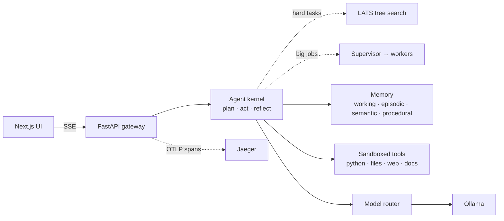

**Why it behaves on a 7B model.** Small models break rules that prompts ask them to follow, so CORTEX enforces the rules in code:

- Plans that need no tools run with no tool schemas at all, and destructive plans become refusals before anything executes.
- Pasted or quoted text is treated as data, so instructions hidden inside it can't trigger a tool.
- Web fetch reaches public hosts only. Loopback, private-network and cloud-metadata addresses are refused after DNS resolution and on every redirect.
- Memory stores only durable facts you state about yourself.

```bash
git clone https://github.com/roydonsequeira/CORTEX-Private-Intelligence-Framework.git && cd CORTEX-Private-Intelligence-Framework
ollama pull qwen2.5:7b && ollama pull nomic-embed-text
pip install -e . && cortex doctor && cortex serve    # API on :8000
cd ui && npm install && npm run dev                   # UI on :3000
```

</details>

<p align="center">
  <a href="https://github.com/roydonsequeira/RagChatbot"><picture><source media="(prefers-color-scheme: dark)" srcset="assets/ragchatbot-dark.svg"><source media="(prefers-color-scheme: light)" srcset="assets/ragchatbot-light.svg"></picture></a>
  <a href="https://github.com/roydonsequeira/clinicalNote-SOAP"><picture><source media="(prefers-color-scheme: dark)" srcset="assets/soap-dark.svg"><source media="(prefers-color-scheme: light)" srcset="assets/soap-light.svg"></picture></a>
  <a href="https://github.com/roydonsequeira/Skin-Lesion-Segmentation-in-TensorFlow-2.0"><picture><source media="(prefers-color-scheme: dark)" srcset="assets/lesion-dark.svg"><source media="(prefers-color-scheme: light)" srcset="assets/lesion-light.svg"></picture></a>
  <a href="https://roydonsequeira.com"><picture><source media="(prefers-color-scheme: dark)" srcset="assets/lab-dark.svg"><source media="(prefers-color-scheme: light)" srcset="assets/lab-light.svg"></picture></a>
</p>

### Recently shipped

<!-- recent-repos:start -->
| Project | What it is | Last push |
| --- | --- | --- |
| [**CORTEX-Private-Intelligence-Framework**](https://github.com/roydonsequeira/CORTEX-Private-Intelligence-Framework)<br><sub>Python</sub> | Private, local-first AI agent: planning, sandboxed tools, four-tier memory, streaming UI and OpenTelemetry — runs entirely on your machine with Ollama. | <code>2026-09-25</code> |
| [**Skin-Lesion-Segmentation-in-TensorFlow-2.0**](https://github.com/roydonsequeira/Skin-Lesion-Segmentation-in-TensorFlow-2.0)<br><sub>Python</sub> | Skin lesion segmentation on ISIC 2018 using U-Net (PyTorch) and ResU-Net (TensorFlow 2). Final year project. | <code>2026-05-25</code> |
| [**RagChatbot**](https://github.com/roydonsequeira/RagChatbot)<br><sub>Python</sub> | Production-quality RAG chatbot: Ollama LLM, ChromaDB vector store, OCR/PDF ingestion, Next.js UI | <code>2026-04-09</code> |
| [**clinicalNote-SOAP**](https://github.com/roydonsequeira/clinicalNote-SOAP) | n8n workflows for AI-powered Clinical SOAP note generation (TTT, STT, TTS) | <code>2026-03-25</code> |
<!-- recent-repos:end -->

<sub>Refreshed daily from the GitHub API by <a href=".github/workflows/readme-sync.yml">readme-sync</a>. New public repositories show up here on their own.</sub>

## How I build agents

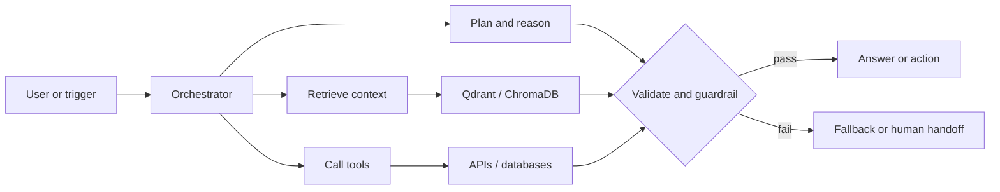

| Principle | What it looks like in production |
| --- | --- |
| **Rules live in code, not prompts** | CORTEX turns destructive plans into refusals before any tool runs, and pasted text can never trigger an action. |
| **Keep the data home** | Local inference on Ollama: the ReinHealth intake agent sent zero patient records to external APIs. |
| **Ground every answer** | Retrieval over Qdrant, ChromaDB and PostgreSQL instead of trusting model memory. |
| **Escalate instead of guessing** | Emergency-symptom escalation, input validation and audit logging in the clinical agent. |
| **Trace everything** | OpenTelemetry spans across model, tool and memory calls, so a failure is debugged as a system rather than guessed at as a prompt. |

## Experience

<picture>
  <source media="(prefers-color-scheme: dark)" srcset="assets/timeline-dark.svg">
  <source media="(prefers-color-scheme: light)" srcset="assets/timeline-light.svg">
  
</picture>

<details>
<summary><b>AI Agent Developer</b> · Code Crew Studio · <i>Feb 2026 – present · Mumbai (remote)</i></summary>
<br>

- Built and maintain a production onboarding agent on the official **WhatsApp Business API** that runs structured intake conversations, classifies user problems and returns analyzed feedback.
- Engineered a multi-turn query system with persistent context across sessions, using **LangChain** for orchestration-heavy flows and direct LLM API calls where latency matters.
- Built **FastAPI** services on **PostgreSQL** for agent state, conversation history and structured customer records.

</details>

<details>
<summary><b>GenAI Engineer</b> · ReinHealth, stealth AI healthcare startup · <i>Jul 2024 – Feb 2026 · Colorado, US (remote)</i></summary>
<br>

- Led end-to-end delivery of a production **autonomous medical intake agent** over text and voice, cutting manual intake work by an estimated **70%** and average intake time from **15 minutes to under 5**.
- Architected an LLM orchestration layer on local **Ollama** inference (intent analysis, follow-up selection, tool execution, grounded synthesis), so **zero patient records** reached external APIs.
- Built a privacy-first **RAG** pipeline on **Qdrant** with PostgreSQL, and automated speech-to-text clinical notes, TTS summaries and conflict-aware scheduling in **n8n**.
- Hardened the platform for clinical use with input validation, emergency-symptom escalation and audit logging, behind a single REST API for agents, workflows and frontend.

</details>

<details>
<summary><b>Machine Learning Intern</b> · Igeeks Technologies · <i>Jun – Jul 2023 · Bengaluru</i></summary>
<br>

- Built CNN, AlexNet and MLP image-classification pipelines on custom datasets, with OpenCV preprocessing and hyperparameter tuning.

</details>

**Education:** B.E. in Artificial Intelligence & Machine Learning, NMAM Institute of Technology (2020–2024) · Executive PG Certification in Data Science & AI, iHUB DivyaSampark, IIT Roorkee (2024–2026)

## Stack

| Layer | Tools |
| --- | --- |
| **Agents & LLMs** | LangChain · ReAct · LATS · supervisor–worker orchestration · Ollama · Claude · Gemini · OpenAI · Hugging Face · STT/TTS |
| **Retrieval** | Qdrant · ChromaDB · BGE and nomic embeddings · semantic search · PostgreSQL · Redis |
| **Backend** | Python · FastAPI · Flask · Pydantic · SQL · REST · SSE streaming |
| **Automation** | n8n · WhatsApp Business API · Twilio |
| **ML & vision** | PyTorch · TensorFlow · scikit-learn · OpenCV · NumPy · Pandas |
| **Ship & observe** | Docker · Linux · GitHub Actions · OpenTelemetry · Vercel · ruff · mypy |
| **Agent UIs** | Next.js · TypeScript · Tailwind CSS |

<p align="center">
  <picture>
    <source media="(prefers-color-scheme: dark)" srcset="https://skillicons.dev/icons?i=python%2Cfastapi%2Cflask%2Cpostgres%2Credis%2Cdocker%2Clinux%2Cgithubactions%2Cpytorch%2Ctensorflow%2Csklearn%2Copencv%2Cnextjs%2Cts%2Ctailwind%2Cvercel&perline=16&theme=dark">
    <source media="(prefers-color-scheme: light)" srcset="https://skillicons.dev/icons?i=python%2Cfastapi%2Cflask%2Cpostgres%2Credis%2Cdocker%2Clinux%2Cgithubactions%2Cpytorch%2Ctensorflow%2Csklearn%2Copencv%2Cnextjs%2Cts%2Ctailwind%2Cvercel&perline=16&theme=light">
    
  </picture>
</p>

<p align="center">
  
  
  
  
  
  
  
  
  
</p>

## Activity

<picture>
  <source media="(prefers-color-scheme: dark)" srcset="https://raw.githubusercontent.com/roydonsequeira/roydonsequeira/output/github-contribution-grid-snake-dark.svg">
  <source media="(prefers-color-scheme: light)" srcset="https://raw.githubusercontent.com/roydonsequeira/roydonsequeira/output/github-contribution-grid-snake.svg">
  
</picture>

<p align="center">
  <picture>
    <source media="(prefers-color-scheme: dark)" srcset="https://streak-stats.demolab.com/?user=roydonsequeira&background=0A0B0D&border=242931&stroke=242931&ring=00E6C3&fire=00E6C3&currStreakNum=EDEFF2&sideNums=EDEFF2&currStreakLabel=00E6C3&sideLabels=8B93A0&dates=5C636E&border_radius=16">
    <source media="(prefers-color-scheme: light)" srcset="https://streak-stats.demolab.com/?user=roydonsequeira&background=FFFFFF&border=DCD8CF&stroke=DCD8CF&ring=00735F&fire=00735F&currStreakNum=121417&sideNums=121417&currStreakLabel=00735F&sideLabels=555A63&dates=7C8089&border_radius=16">
    
  </picture>
</p>

<br>

<a href="mailto:roydnsequeira@gmail.com">
  <picture>
    <source media="(prefers-color-scheme: dark)" srcset="assets/footer-dark.svg">
    <source media="(prefers-color-scheme: light)" srcset="assets/footer-light.svg">
    
  </picture>
</a>

<p align="center">
  <a href="mailto:roydnsequeira@gmail.com"></a>
  <a href="https://roydonsequeira.com"></a>
  <br><br>
  
</p>
